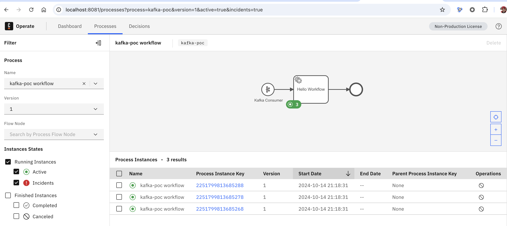

# pure docker-compose setup (with dockerized container runtime)

## setup with runtime via docker-compose
cd docker

### Option 1 (working): docker-compose with camunda/connectors-bundle:8.6.2
docker-compose -f ./docker-compose.yml up -d

### Option 2 (not working): docker-compose without connectors
docker-compose -f ./docker-compose-without-connectors.yml up -d

Run Spring Boot project from IDE with Env Vars:
CAMUNDA_IDENTITY_AUDIENCE=operate-api;CAMUNDA_IDENTITY_CLIENT_ID=connectors;CAMUNDA_IDENTITY_CLIENT_SECRET=XALaRPl5qwTEItdwCMiPS62nVpKs7dL7;CAMUNDA_IDENTITY_ISSUER_BACKEND_URL=http://localhost:18080/auth/realms/camunda-platform;CAMUNDA_IDENTITY_TYPE=KEYCLOAK;CAMUNDA_OPERATE_CLIENT_URL=http://localhost:8081;CONNECTOR_KAFKA_EXECUTABLE=io.camunda.connector.kafka.inbound.KafkaExecutable;KAFKA_BOOTSTRAP_SERVER=kafka:9093;KAFKA_GROUP_ID=jensgroup;KAFKA_TOPIC=jenstest;SSL_TRUSTSTORE_LOCATION=/Users/jens/projects/git/j-lindner/kafka-inbound-via-code/src/main/resources/kafka.server.truststore.jks;SSL_TRUSTSTORE_PASSWORD=password;ZEEBE_AUTHENTICATION_MODE=none;ZEEBE_AUTHORIZATION_SERVER_URL=http://localhost:18080/auth/realms/camunda-platform/protocol/openid-connect/token;ZEEBE_CLIENT_BROKER_GATEWAY-ADDRESS=localhost:26500;ZEEBE_CLIENT_CONFIG_PATH=/tmp/zeebe_auth_cache;ZEEBE_CLIENT_ID=zeebe;ZEEBE_CLIENT_SECRET=zecret;ZEEBE_CLIENT_SECURITY_PLAINTEXT=true;ZEEBE_TOKEN_AUDIENCE=zeebe-api

### Option 3 (not working): docker-compose with dockerized spring boot app
Package jar:
mvn clean package

Build Dockerfile in root:
docker build --tag=kafka-ws-service:latest .

docker-compose -f ./docker-compose-with-custom-image.yml up -d

## create topic
docker exec -it kafka kafka-topics --create \
--bootstrap-server localhost:9093 \
--command-config /etc/kafka/secrets/client-ssl.properties \
--replication-factor 1 \
--partitions 1 \
--topic jenstest

## create messages
docker exec -it kafka kafka-console-producer --broker-list localhost:9093 --topic jenstest --producer.config /etc/kafka/secrets/client-ssl.properties

then enter some lines to publish some messages.

## deploy via modeler
For option 1&3: deploy kafka_poc_with_tls_jens.bpmn via modeler
For option 2: deploy kafka_poc_with_tls_jens_spring.bpmn via modeler

## Verify by checking Operate (only working for Option 1)

