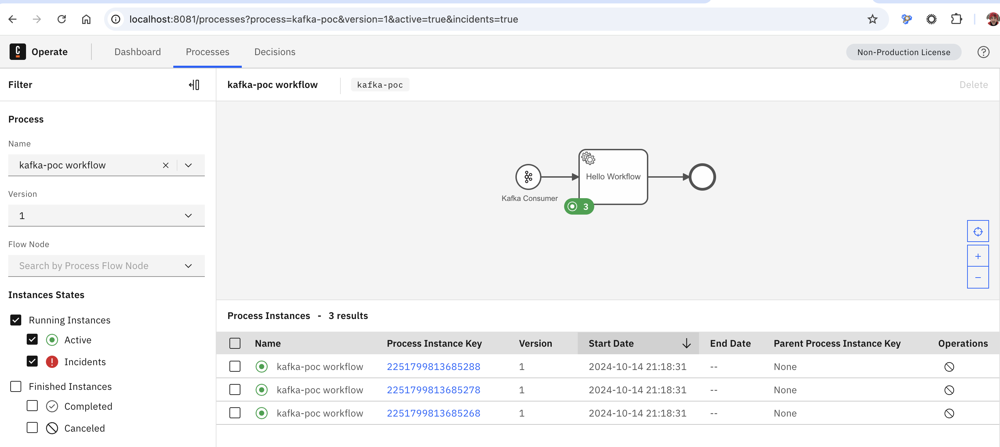

# setup with spring

## settings
"kafka" resolves to localhost; content in /etc/hosts:  
127.0.0.1 kafka

## setup with runtime via docker-compose
cd docker

docker-compose -f ./docker-compose-without-connectors.yml up -d  

## create topic  
docker exec -it kafka kafka-topics --create \
--bootstrap-server localhost:9093 \
--command-config /etc/kafka/secrets/client-ssl.properties \
--replication-factor 1 \
--partitions 1 \
--topic jenstest  

## create messages  
docker exec -it kafka kafka-console-producer --broker-list localhost:9093 --topic jenstest --producer.config /etc/kafka/secrets/client-ssl.properties  
  
then enter some lines to publish some messages.  

## deploy via modeler
deploy kafka_poc_with_tls_jens_spring.bpmn via modeler  

## start aplication
mvn spring-boot:run

## send some more messages
...

## Verify by checking Operate  
  

